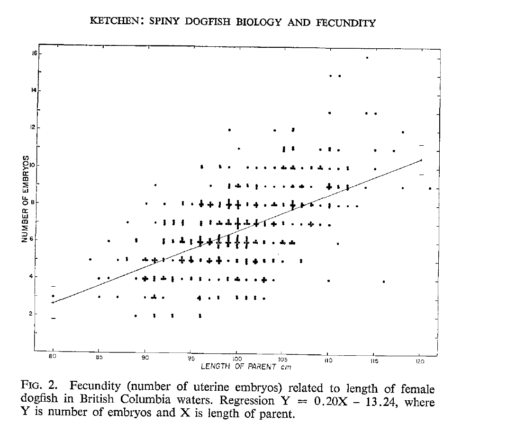
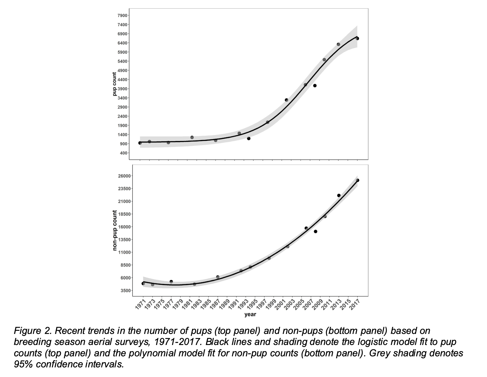

```{r preamble, include=FALSE, cache=FALSE}
## Build me with live updates with:
## xaringan::inf_mr()
library(knitr)
xaringanthemer::style_mono_accent(
  base_color = "#202020",
  header_font_google = xaringanthemer::google_font("Raleway"),
  text_font_google = xaringanthemer::google_font("Open Sans"),
  code_font_google = xaringanthemer::google_font("Fira Mono"),
  title_slide_background_size = "14%",
  title_slide_background_position = "50% 90%",
  base_font_size = "20px",
  header_h1_font_size = "2.0rem",
  header_h2_font_size = "1.8rem",
  header_h3_font_size = "1.6rem",
  text_font_size = "1.4rem",
  code_font_size = "1.1rem",
  link_color = "#0047AB"
)
knitr_opts <- list(
  message = FALSE,
  warning = FALSE,
  collapse = TRUE,
  comment = "#>",
  fig.width = 7,
  dpi = 300,
  out.width = "100%",
  fig.asp = 1 / 1.618,
  cache = TRUE,
  autodep = TRUE,
  cache.comments = TRUE,
  fig.align = "center",
  echo = FALSE
)
do.call(knitr::opts_chunk$set, knitr_opts)
```

class: center, middle, inverse

#  This is a section break as a demo

---
class: center, middle

#  This is a sub-section break

---
#  This is a regular slide with one figure at 80% width

```{r, out.width="80%"}
include_graphics("../figs/reconstructed-catch-discards-outside-sar.png")
```

.xsmall[And some extra small text (see theme.css for other sizes).]

---
#  This is a 2-column slide

.pull-left[
Point one

Point two

Point three
]

.pull-right[
```{r, out.width="90%"}
include_graphics("../figs/synoptic/depth_marginal.png")
```
]

---
#  This is a 2-column slide with smaller bullets

.xsmall[
.pull-left[
- Point one

- Point two

- Point three
]
]

.pull-right[
```{r, out.width="85%"}
include_graphics("../figs/synoptic/depth_marginal.png")
```
]

---
#  These bullets are releaved one by one

--

- Point one

--

- Point two

--

- Point three

---
# Dropping in some external image

I've been putting them in `assets/img` and git force adding:

```{r, out.width="50%"}

```

Equation:

$$
y = x
$$

---
class: center, middle, inverse

#  End of demo!

---
class: center, middle, inverse

#  Dogfish life history and ecology 

---
class: center, middle, inverse

#  Dogfish stock structure 

---
class: center, middle, inverse

#  Stock structure 

---
class: center, middle, inverse

#  Commercial fishery history 

---

#  Assessment history 


### Wood et al. 1979:

.small[
- Estimated unfished vulnerable biomass (BC to Oregon) of 200,000 tonnes from Delury and Leslie depletion models
- Assumed pup survival and recruitment was density-independent.
- M = 0.094, solved from the maturity and fecundity schedule
- MSY was estimated to be 9-11 thousand tonnes where MSY = FMSY * 200,000 and FMSY = 0.5 M
- Natural mortality was proposed as the density-dependent mechanism for the yield curve.
- Alternative hypotheses of density-dependent growth and fecundity were biologically implausible to achieve the proposed MSY value.
]

---

#  Assessment history 

### Gallucci et al. 2010:

.xsmall[
- Surplus production model, was not used for advice
]

---
#  Nearby assessments 

Gulf of Alaska

US West Coast

---
class: center, middle, inverse

#  Data 

---
#  Commercial catch data 

```{r}
include_graphics("../figs/reconstructed-catch-discards-outside-sar.png")
```

---
#  Catch data (including commercial and recreational salmon) 

```{r}
include_graphics("../figs/ss3/catch_fleet_discard_landings.png")
```

---
#  Population indices 

```{r, out.width="650px"}
include_graphics("../figs/ss3/index.png")
```

---
class: center, middle, inverse

#  An aside on the index standardization approach 

---
#  General approach 

- Fit spatiotemporal models to Dogfish catch weight or count with 'offset' for effort

- Use delta-lognormal or negative binomial (NB2) observation error

- Predict on grid covering survey each year; sum density across grid

- Calculate standard errors with generalized delta method

.tiny[
Thorson, J.T., Shelton, A.O., Ward, E.J., and Skaug, H.J. 2015. Geostatistical delta-generalized linear mixed models improve precision for estimated abundance indices for West Coast groundfishes. ICES J. Mar. Sci. 72(5): 1297–1310.

Anderson, S.C., Ward, E.J., English, P.A., Barnett, L.A.K., and Thorson, J.T. 2024. sdmTMB: An R package for fast, flexible, and user-friendly generalized linear mixed effects models with spatial and spatiotemporal random fields. In press at J. Stat. Softw. doi:10.1101/2022.03.24.485545.
]

---

class: center, middle

#  Synoptic trawl surveys
With a deeper dive into the methods than for other surveys

---
#  Synoptic West Coast Haida Gwaii (SYN WCHG) 

```{r, out.width="420px"}
include_graphics("../figs/synoptic/sets-wchg.png")
```

---
#  Synoptic Queen Charlotte Sound (SYN QCS) 

```{r, out.width="100%"}
include_graphics("../figs/synoptic/sets-qcs.png")
```

---
#  Synoptic Hecate Strait (SYN HS) 

```{r, out.width="100%"}
include_graphics("../figs/synoptic/sets-hs.png")
```

---
#  Synoptic West Coast Vancouver Island (SYN WCVI) 

```{r, out.width="100%"}
include_graphics("../figs/synoptic/sets-wcvi.png")
```

---
# Synoptic survey grid depth

```{r, out.width="70%"}
include_graphics("../figs/synoptic/prediction_grid_depth.png")
```

---
#  Bottom depth response curve

```{r, out.width="45%"}
include_graphics("../figs/synoptic/depth_marginal.png")
```

---
# Quantile-quantile residual checks

```{r, out.width="60%"}
include_graphics("../figs/synoptic/qq-lg.png")
```

---
# Spatial correlation anisotropy

```{r, out.width="70%"}
include_graphics("../figs/synoptic/aniso-lg.png")
```

---
#  Spatial random field <br>.tiny[(constant latent spatial effects)]

```{r, out.width="70%"}
include_graphics("../figs/synoptic/prediction_grid_omega.png")
```

---
#  Spatiotemporal random fields <br>.tiny[(latent spatial effects that change through time)]

```{r, out.width="58%"}
include_graphics("../figs/synoptic/prediction_grid_eps.png")
```

---
#  Predicted encounter probability 

```{r, out.width="60%"}
include_graphics("../figs/synoptic/prediction_grid_encounter.png")
```

---
#  Predicted biomass density 

```{r, out.width="60%"}
include_graphics("../figs/synoptic/prediction_grid_density.png")
```

---
# Resulting index

Sum the predictions across the survey grid<br>
Derive uncertainty with generalized delta method

```{r, out.width="65%"}
include_graphics("../figs/synoptic/syn_index.png")
```

---
class: center, middle

#  Outside hard bottom longline (HBLL) survey 

---
#  Outside HBLL CPUE 

```{r, out.width="60%"}
include_graphics("../figs/hbll_out/cpue.png")
```

---
class: center, middle
#  International Pacific Halibut Commission (IPHC) setline survey 

---
#  IPHC CPUE by set 

```{r, out.width="60%"}
include_graphics("../figs/iphc/cpue.png")
```

---
class: center, middle
#  Hecate Strait Multispecies Assemblage (HS MSA) Survey

---
#  HS MSA set-level CPUE 

```{r, out.width="53%"}
include_graphics("../figs/msa/cpue-map.png")
```

---
class: center, middle
#  Commercial bottom trawl catch per unit effort (CPUE) 

---
#  Model-predicted commercial trawl CPUE 

```{r, out.width="75%"}
include_graphics("../figs/cpue/map-est.png")
```

---
#  Population indices 

```{r, out.width="650px"}
include_graphics("../figs/ss3/index.png")
```

---
class: center, middle, inverse

#  Length composition data 

---
#  Synoptic trawl survey lengths

```{r, out.width="50%"}
include_graphics("../figs/lengths-synoptic-outside.png")
```

---
#  IPHC survey lengths

```{r, out.width="44%"}
include_graphics("../figs/lengths-iphc.png")
```

---
#  Commercial trawl retained lengths

```{r, out.width="54%"}
include_graphics("../figs/lengths-commercial-outside-retained.png")
```

---
#  Commercial trawl discard lengths

```{r, out.width="55%"}
include_graphics("../figs/lengths-commercial-outside-discard.png")
```

---
class: center, middle, inverse

#  Biological parameters estimated outside the assessment model 

---
#  Length-weight relationship 

```{r, out.width="100%"}
include_graphics("../figs/length-weight-survey-outside.png")
```

---
#  Length-age relationship 

```{r, out.width="100%"}
include_graphics("../figs/length-age-comparison.png")
```

---
#  Natural mortality 

TODO

---
#  BC + US samples vs. US-assessment estimated 

```{r, out.width="95%"}
include_graphics("../figs/ss3/growth-compare.png")
```

---
#  Maturity ogives (55 vs. 77)

```{r, out.width="100%"}
include_graphics("../figs/maturity-outside-survey-compare.png")
```

---
#  Possible maturity ogives

```{r, out.width="90%"}
include_graphics("../figs/ss3/mat-lit-with-synoptic.png")
```

---
#  Fecundity at length

Fecundity (2–16 pups/pregnant female) is a linear function of size (Ketchen 1972)

```{r, out.width="65%"}

```

---
#  Fecundity at length and age

Based on Ketchen (1972); convert length to age

```{r, out.width="100%"}
include_graphics("../figs/ss3/set_a_mat/fecundity.png")
```

---
#  Unfished replacement line

```{r, out.width="90%"}
include_graphics("../figs/ss3/M_bound_fec.png")
```

Low fecundity implies an upper bound on natural mortality 

---
class: center, middle, inverse

#  Population Dynamics Model

---
#  A need for a stock-recruit curve for Dogfish-like species 

Unfished population N = 100 adults, which produce 10 pups/adult, that's 1,000 pups (B0).

If density-dependent unfished pup survival is 0.6, then we get 600 recruits (R0).

A population of N = 20 (0.2 B0) produces 200 pups. If steepness were 1 in a closed population, we'd have to conjure 600 recruits from 200 pups.

Thus, in this example, steepness is capped at 0.33: 200 pups at 0.2B0 divided by 600 pups when unfished.

---
#  Dogfish stock recruit relationship

\begin{aligned}
R_y &= S_y \times \exp\left(-z_0 + (z_0 - z_\mathrm{min})\left(1 - \frac{S_y}{S_0}\right)^\beta\right)\\
z_\mathrm{min} &= z_0(1 - z_\mathrm{frac})\\
z_0 &= -\log(1/\phi_0)
\end{aligned}

$z_\mathrm{frac}$ is the proportion of unfished density dependent mortality when stock → zero (0–1, higher = more productive stock)

$\beta$ controls concavity in density dependent mortality as stock declines (1 = linear)

.tiny[
Taylor, I.G., Gertseva, V., Methot, R.D., and Maunder, M.N. 2013. A stock–recruitment relationship based on pre-recruit survival, illustrated with application to spiny dogfish shark. Fisheries Research 142: 15–21.
]

---
#  Stock recruit relationship: $z_\textrm{frac}$

```{r, out.width="70%"}
include_graphics("../figs/ss3/prof/prof_zfrac_SR.png")
```

---
#  Steller sea lion abundance 1971--2017 

```{r, out.width="70%"}

```

.tiny[
DFO. 2021. Trends in Abundance and Distribution of Steller Sea Lions (*Eumetopias jubatus*) in
Canada. DFO Can. Sci. Advis. Sec. Sci. Advis. Rep. 2021/035.
]

---
class: center, middle, inverse

#  Model Results 

---

# Estimated numbers at age

```{r, out.width="60%"}
include_graphics("../figs/ss3/set_a_mat/N_age_A1.png")
```

---

# Estimated selectivity at age

```{r, out.width="94%"}
include_graphics("../figs/ss3/set_a_mat/sel_age_max1.png")
```

---

#### Length composition are not informative about depletion

```{r, out.width="43%"}
include_graphics("../figs/ss3/set_a_mat/len_comp_1937_model1.png")
```

---
#  Time-varying natural mortality 

```{r, out.width="100%"}
include_graphics("../figs/ss3/set_b/M_year.png")
```

---
#  MCMC sampling 

---
class: center, middle, inverse
#  Reference Points

---

# Why work with spawning output over spawning biomass

TODO

---

# Why work with depletion-based over MSY-based reference points

TODO

---

#  $S/S_0$: spawning output over unfished spawning output

```{r, out.width="100%"}
include_graphics("../figs/ss3/refpts/depl-ref-ts.png")
```

---
#  $S/S_0$ for models with time-varying M 

```{r, out.width="100%"}
include_graphics("../figs/ss3/refpts/depl-ref-ts-B.png")
```

---
#  $F_\mathrm{0.4S0}$: a candidate removal reference rate  


```{r, out.width="100%"}
include_graphics("../figs/ss3/refpts/f-ref-ts.png")
```

---
#  Catch in 2024 at $F_\mathrm{0.4S0}$

```{r, out.width="500px"}
include_graphics("../figs/ss3/refpts/2024-yield-catch.png")
```

*Discard mortality rate must still be applied*

---
##  Probability $S > 0.2S_0$ under fixed catches 

<br>

```{r, out.width="100%"}
include_graphics("../figs/ss3/refpts/lrp-ref-pt-tigure.png")
```
  
---
#  Probability $S > 0.4S_0$ under fixed catches 

<br>

```{r, out.width="100%"}
include_graphics("../figs/ss3/refpts/usr-ref-pt-tigure.png")
```

---
##  Probability $F < F_\mathrm{0.4S0}$ under fixed catches 

<br>

```{r, out.width="100%"}
include_graphics("../figs/ss3/refpts/f-ref-pt-tigure.png")
```

---
class: center, middle, inverse
#  COSEWIC Considerations

---

# COSEWIC criteria

COSEWIC Metric A measures the probability that the stock has declined by 70%, 50% or 30% "over the last 10 years or 3 generations, whichever is longer", but is also interpreted as a decline over the longest time series available. 

We define the generation time as 1/M + age at 50% maturity. I.e., 1/0.065 + 33.5 = ~50 years

Entire assessment (1937 = 2023, 86 years) = ~1.7 generations.

---
#  Rates of decline 

<br>

```{r, out.width="100%"}
include_graphics("../figs/cosewic-decline-indexes.png")
```

---
class: center, middle, inverse
#  Rebuilding Considerations 

---
# Rebuilding Considerations 

.small[
Dogfish are subject to DFO's Precautionary Approach (PA) Framework under the Sustainable Fisheries Framework (SFF).
]

--

.small[
The PA Framework: "when a stock has reached the Critical Zone [below the LRP], a rebuilding plan must be in place with the aim of having a high probability of the stock growing out of the Critical Zone within a reasonable timeframe."
]

--

.small[
Guidelines:
"a 'reasonable timeframe' for a stock to grow above its LRP should be between 1.5 to 2 times the generation time. However, for some stocks a longer time may be needed to reach its rebuilding target, for example due to a stock's highly depleted state or its current productivity."
]

--

.small[
*This assessment is not a rebuilding plan.*
]

---
#  Forecasts of $S/S_0$ under fixed catch scenarios 

```{r, out.width="100%"}
include_graphics("../figs/ss3/refpts/rebuild-facet-model.png")
```

---
#  Years forecasted before $S/S_0 > 0.2$ 

```{r, out.width="650px"}
include_graphics("../figs/ss3/refpts/rebuild-timeframe-dots.png")
```

---
class: center, middle, inverse

#  Discussion 

---
#  Improvements over previous assessment 


---
#  Challenges fitting some population indices 


---
#  Perception of depletion was relatively robust 

- Estimated current status is inferred from the decline in indices in light of low catches relative to historical levels.
 
- TODO

---
#  Mortality on juvenile Dogfish in the trawl discards 


---
class: center, middle, inverse
#  Environmental Considerations 

---
#  Environmental conditions not explicitly modeled 

- But modelled time-varying natural mortality

- Dogfish "integrate" over many years of environmental condition (Taylor and Galluci 2009)

- English et al. (2021) did not find any strong patterns in changes to outside BC Dogfish distribution correlated with local changes to bottom temperature or dissolved oxygen

---
#  Environmentally driven movement? 

- Movement north?

- Movement offshore?

- Movement seasonally?

---
#  Movement north? 

- Increases in water temperature could cause Dogfish to move north to Alaska causing declines in our survey indices.

--

- However, English et al. (2021) did not find any strong correlations between local changes in temperature and oxygen and changes to dogfish distribution.

--

- Dogfish have a wide thermal tolerance already.

--

- Most importantly, Dogfish have declined in the Gulf of Alaska over the last 20 years as well...

---
#  Trawl survey declines are coastwide 

```{r, out.width="600px", eval=FALSE}
include_graphics("assets/img/image58.png")
```

.xsmall[Davidson et al. In prep.]

---
#  Movement offshore? 

- If stock moved offshore outside of survey domains, could cause decline in indices.

--

- But, the trawl survey (and commercial CPUE) already extend deeper than Dogfish are typically found and we don't see evidence of increases further offshore.

--

- Although there *is* evidence of steeper declines in shallow waters...

---
#  Steeper commercial CPUE declines in shallow areas, but still declining in deeper waters 


```{r, out.width="800px"}
include_graphics("../figs/cpue/cpue-by-depth.png")
```

---
#  Sablefish survey Dogfish index (deep) is not increasing 

Trap survey, October-November, 200 m to 1000 m.

.pull-left[]

.pull-right[]

---
#  Movement seasonally? 

- Changes to seasonal migration could cause trends in survey catchability.

- But, commercial CPUE was year-round and trend was largely same across months...

---
#  Standardized CPUE by month (fixed y-axis) 

```{r, out.width="600px"}
include_graphics("../figs/cpue/cpue-lines-by-month-facets-abs.png")
```

---
#  Standardized CPUE by month (scaled to have geometric mean = 1) 


```{r, out.width="600px"}
include_graphics("../figs/cpue/cpue-lines-by-month-facets.png")
```

---
#  Slopes of CPUE by month 


```{r, out.width="700px"}
include_graphics("../figs/cpue/cpue-slopes-by-month.png")
```

---
#  Environmentally driven movement? 

* Taken together, we do not observe compelling evidence of northward, offshore, or seasonal shifts in distribution that would explain the majority of the declines in the indices of Dogfish biomass or abundance.

--

* Regardless of cause, there are fewer Dogfish in BC outside waters than there were 20 years ago when surveys began.

---
class: center, middle, inverse
#  Conclusions

---
#  Conclusions

TODO

---
class: center, middle, inverse
#  Research Recommendations 

---
#  Research recommendations 

* Current data streams (although important) are unlikely to substantially improve our understanding of BC Dogfish in the near future

--

* Develop coastwide picture of changes in Dogfish abundance and distribution

--

* Examine Steller and California sea lion diet

--

* Aging of modern samples

--

* Close-kin mark-recapture?

---
#  Timeline to revisit assessment 

* Recommended around 5 years

* Stock is assessed below LRP

* But slow life history—unlikely to rapidly change

* Increase in small dogfish in SYN WCVI survey?

* May behave in unexpected ways given we were unable to fit full decline for 2 surveys

* Monitor in groundfish data synopsis report

---
#  Thank you

Members of the Technical Working Group:<br>
T. Carruthers,
D. Edwards,
P. English,
D. Finn,
N. Fisch,
E. Fisher,
R. Forrest,
D. Haggarty,
G. Mason,
L. Rogers,
C. Sporer, and
B. Turris.

G.A. McFarlane for advice on maximum Dogfish age.

I.G. Taylor for advice on the Dogfish stock-recruit function.

D.L. Courtney and S.A. Pardo for providing constructive reviews.

---
class: center, middle, inverse

#  Extra Slides 

---