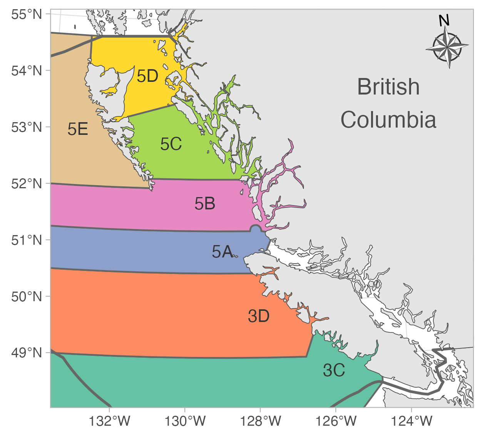
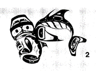
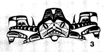
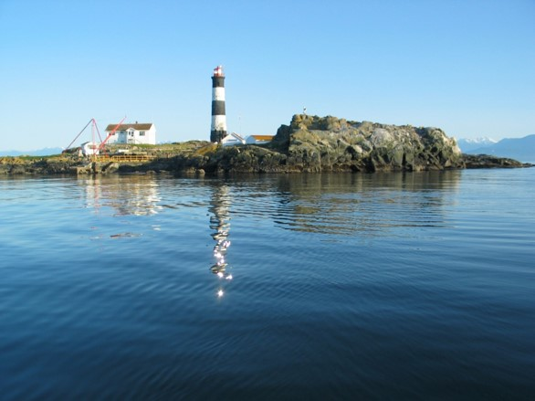
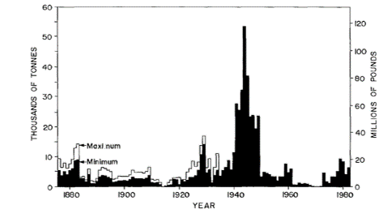
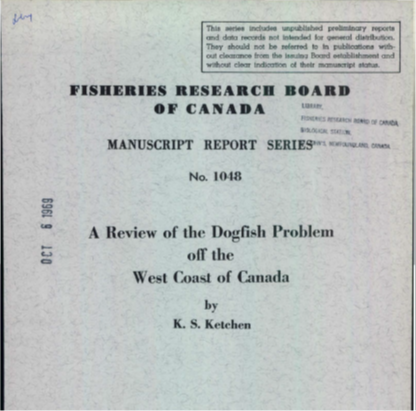

```{r preamble, include=FALSE, cache=FALSE}
## Build me with live updates with:
## xaringan::inf_mr()
library(knitr)
xaringanthemer::style_mono_accent(
  base_color = "#202020",
  header_font_google = xaringanthemer::google_font("Raleway"),
  text_font_google = xaringanthemer::google_font("Open Sans"),
  code_font_google = xaringanthemer::google_font("Fira Mono"),
  title_slide_background_size = "14%",
  title_slide_background_position = "50% 90%",
  base_font_size = "20px",
  header_h1_font_size = "2.0rem",
  header_h2_font_size = "1.8rem",
  header_h3_font_size = "1.6rem",
  text_font_size = "1.4rem",
  code_font_size = "1.1rem",
  link_color = "#0047AB"
)
knitr_opts <- list(
  message = FALSE,
  warning = FALSE,
  collapse = TRUE,
  comment = "#>",
  fig.width = 7,
  dpi = 300,
  out.width = "100%",
  fig.asp = 1 / 1.618,
  cache = TRUE,
  autodep = TRUE,
  cache.comments = TRUE,
  fig.align = "center",
  echo = FALSE
)
do.call(knitr::opts_chunk$set, knitr_opts)
```

# Outline

1. Life history, ecology, and stock structure
1. Fishery and assessment history
1. Input data sources (including index standardization)
1. Parameters estimated externally to the assessment model
1. Assessment model
1. Assessment model results
1. Reference points
1. COSEWIC & rebuilding considerations
1. Environmental considerations
1. Discussion & future research
1. Timeline to revisit assessment

---
class: center, middle, inverse

#  Dogfish life history, ecology, and stock structure

---

# Dogfish life history

.small[
.pull-two-thirds-left[
- Maximum age ~ 80–85 years

- Maximum size ~ 160 cm

- Late maturing: ~ 35 years (95 cm) for females; ~ 25 years (70 cm) for males

- One of longest gestations among all animals (~ 2 years)

- Low intrinsic population growth rate, even among sharks
]]

.pull-third-right[

]

---

# Dogfish ecology

.small[
- Inhabit surface to ~1,000 m; older dogfish more likely on bottom; males generally shallower than females.
]

--

.small[
- Opportunistic feeders: invertebrates (squid, jellyfish, crabs, and euphausiids) and fish (Pacific herring, Pacific salmon, flatfish, and eulachon)
]

--

.small[
- Time between feeding as long as 16 days
]

--

.small[
- Predators include large fish such as Lingcod, other sharks such as Bluntnose Sixgill Shark, marine mammals such as offshore killer whales, and Steller and California sea lions
]

---

#  Dogfish stock structure

.pull-two-thirds-left[
.xsmall[
- Tagging data suggest:
  - an offshore population from Baja California to Aleutian Islands and Bering Sea
  - a coastal population in the Strait of Georgia
  - a coastal population in Puget Sound

- This assessment focuses on the offshore BC stock

- Tagging data suggest low rates (< 5%) of exchange between US and Canadian waters

- Dogfish tagged off Washington and Vancouver Island tend to migrate south in winter and north in summer
]
]

.pull-third-right[
```{r, out.width="100%"}

```
]

---
class: center, middle, inverse

#  Dogfish history of fishing and use on the BC coast

---

#  First Nations use

.pull-two-thirds-left[
.xsmall[
- Dogfish spines found in middens across BC 

- Uses of Dogfish include skin for sandpaper, liver for oil for tanning/burning, meat as a potential starvation food

- Dogfish Woman: most powerful supernatural being in Haida Nation, she derives her powers from Dogfish
]
]

.pull-third-right[
```{r, out.width="100%"}

#
#include_graphics("assets/img/dogfish-woman-airport.png")
#
```
]

.tiny[
<!-- (1) Bill Reid, Vancouver, B.C.,  -->
Credit: Norman Tait
<!-- , and (3) Robert Davidson, Whonnock, B.C.  -->

<br>
<br>
<br>
<br>
Ketchen, K.S. 1986. The spiny dogfish (*Squalus acanthias*) in the Northeast Pacific and a history of its utilization. Can. Spec. Publ. Fish. Aquat. Sci. 88:78 p.
]

---
#  Commercial fishery history
.xsmall[
- 1870–1916: livers and body oil for industrial lubrication and lighting

- Dogfish oil was burned for lighting in lighthouses, coal mines, steamers, and sailing vessels; used for lubricating sawmills

- Decline of whaling lead to increase in Dogfish catches

- 2nd only to canned salmon in value in BC

- 1917–1937 no outside BC fishery
]

```{r, out.width="30%"}

```

.tiny[
Ketchen, K.S. 1986. The spiny dogfish (Squalus acanthias) in the Northeast Pacific and a history of its utilization. Can. Spec. Publ. Fish. Aquat. Sci. 88:78 p.
]

```{r, out.width="40%"}
#
```

---
#  Commercial fishery history (1937–1950)
.xsmall[
- 1937–1950 Dogfish livers for Vitamin A
- Rising demand for soldiers during war
- The invasion of Norway (1940) cut off cod liver oil supplies leading to demand from alternative sources
- Pregnant (large) females and large males had the highest vitamin A concentrations
- Peak catch in BC: 120 million pounds of Dogfish
- Move to synthetic vitamin A + declines in abundance ended the fishery
]

```{r, out.width="34%"}

```

.tiny[
Ketchen, K.S. 1986. The spiny dogfish (Squalus acanthias) in the Northeast Pacific and a history of its utilization. Can. Spec. Publ. Fish. Aquat. Sci. 88:78 p.
]

---
#  Commercial fishery history (1951–1974)
.pull-two-thirds-left[
.xsmall[
- 1951–1974 government subsidy programs, eradication

- "The Pestilence Returns" (1958) leading to calls for eradication of Dogfish on WCVI, SOG, and in Washington
 
- Federal subsidy to kill dogfish in SOG and other parts of the coast (1959)

- "Killer" trawl boats had trouble catching large amounts of Dogfish

- 1962–1966 unsuccessful attempts to develop a food fishery (discovery of mercury further hampered this)
]
]

.pull-third-right[
```{r, out.width="100%"}

```
]

.tiny[
Ketchen, K.S. 1969. A review of the Dogfish problem off the West Coast of Canada. Fish. Res. Board. 29 p.
]

---
# Commercial fishery history (1975–2005)

- Food fishery developed

- Mostly in Strait of Georgia initially

- Shifted to outside BC waters

- Initially mainly trawl eventually transitioned to longline gear

```{r, out.width="40%"}
include_graphics("../figs/reconstructed-catch-discards-outside-zoom-high-risk-band.png")
```

---
##  Commercial fishery history (2006–present)

.xsmall[
- Severe restrictions on rockfish in Strait of Georgia and Individual Vessel Quota system led to decline in Dogfish fishing

- Marine Stewardship Council certification (2011)

- 9 active vessels in 2012, none since 2017 (one license in 2019)

- Now: no targeted fishing, regularly caught and discarded, mostly in midwater and bottom trawl fleets

- TAC 12,000t: 8,160 t for Dogfish sector; 3,840 t for trawl sector
]

```{r, out.width="40%"}
include_graphics("../figs/reconstructed-catch-discards-outside-zoom-high-risk-band.png")
```

???

TAC is double the height of y-axis upper limit

---

##  Assessment history: Wood et al. 1979

.xsmall[
- Estimated unfished vulnerable biomass (BC to Oregon) of 200,000 t from Delury and Leslie depletion models

- Assumed pup survival and recruitment was density-independent

- M = 0.094, solved from the maturity and fecundity schedule

- MSY was estimated to be 9,000–11,000 t where MSY = FMSY $\times$ 200,000 and FMSY = 0.5 M

- Natural mortality proposed as density-dependent mechanism for yield curve

- Alternative hypotheses of density-dependent growth and fecundity deemed biologically implausible to achieve the proposed MSY value
]

---

##  Assessment history: Saunders 1980s

.small[
- Wood et al. 1979 model updated by Saunders in 1985, 1986, 1987, and 1989

- 1989 catch recommendations were for Alaska–California stock:
  - 9,000 t = "low risk"
  - 9,000–14,000 t = "high risk" (of declines)

- Basis for current TAC with some adjustments

- Saunders 1989 assumed BC was 1/2 to 2/3 of stock
  - therefore, 4,500–9,333 t was "high risk"
]

---

##  Assessment history: Gallucci et al. 2010

.small[
- Surplus production model

- Catch data from longline and trawl fisheries; commercial CPUE, IPHC, NMFS Triennial survey, HS MSA survey indices
  
- Synoptic trawl and HBLL surveys too short at the time

- Challenges with parameter estimation

- "No consensus reached on a scientifically valid approach on which to base yield recommendations"

- Reduction in the size distribution, long generation time, low fecundity, uncertainty in population trends, vulnerability elsewhere resulted in COSEWIC "Special Concern" in 2011
]

---
#  Nearby assessments: Gulf of Alaska

- Not targeted but frequently encountered and discarded

- Demographic model and risk analysis (Tribuzio et al. 2022)

- Overfishing limits set based on maximum historical catch

- Last assessed as not overfished

---
#  Nearby assessments: US West Coast

- Similar vitamin A fishery history

- Not targeted since vitamin A fishery, but sometimes landed as part of a food fishery since 1973 

- Estimated at 34% of unfished spawning output (above overfished threshold of 25% but below target of 40%)

- Overfishing estimated during vitamin A fishery and in 1980s–early 1990s

- Similar data and SS3 model to what we will present here for BC; similar challenges

---
class: center, middle, inverse

#  Data 

---
#  Commercial catch data 

```{r}
include_graphics("../figs/reconstructed-catch-discards-outside-sar.png")
```

---
#  Catch data<br>.tiny[(including commercial and recreational salmon)]

```{r}
include_graphics("../figs/ss3/catch_fleet_discard_landings.png")
```

.tiny[
- iREC and bycatch in units of thousand pieces. Commercial catch in units of tonnes.
]

---
#  Population indices 

```{r, out.width="60%"}
include_graphics("../figs/ss3/index.png")
```

- Declining indices in all, but at different rates/trends

---
class: center, middle, inverse

#  An aside on the index standardization approach 

---
#  General approach 

.xsmall[
- Spatiotemporal modelling to estimate density over a spatial grid of the survey. Approach imputes abundance in missing time/area strata, e.g., for Synoptic survey

- Fit spatiotemporal models to Dogfish catch weight or count with "offset" for effort

- Depth as a quadratic fixed effect

- Use delta-lognormal or negative binomial observation error

- Predict on grid covering survey each year; sum density

- Calculate standard errors with generalized delta method
]

.tiny[
Thorson, J.T., Shelton, A.O., Ward, E.J., and Skaug, H.J. 2015. Geostatistical delta-generalized linear mixed models improve precision for estimated abundance indices for West Coast groundfishes. ICES J. Mar. Sci. 72(5): 1297–1310.

Anderson, S.C., Ward, E.J., English, P.A., Barnett, L.A.K., and Thorson, J.T. 2024. sdmTMB: An R package for fast, flexible, and user-friendly generalized linear mixed effects models with spatial and spatiotemporal random fields. In press at J. Stat. Softw. doi:10.1101/2022.03.24.485545.
]

---

class: center, middle

#  Synoptic trawl surveys
With a deeper dive into the methods than for other surveys

---
##  Synoptic West Coast Haida Gwaii (SYN WCHG) 

```{r, out.width="420px"}
include_graphics("../figs/synoptic/sets-wchg.png")
```

---
##  Synoptic Queen Charlotte Sound (SYN QCS) 

```{r, out.width="100%"}
include_graphics("../figs/synoptic/sets-qcs.png")
```

---
##  Synoptic Hecate Strait (SYN HS) 

```{r, out.width="100%"}
include_graphics("../figs/synoptic/sets-hs.png")
```

---
###  Synoptic West Coast Vancouver Island (SYN WCVI) 

```{r, out.width="100%"}
include_graphics("../figs/synoptic/sets-wcvi.png")
```

---
# Synoptic survey grid depth

```{r, out.width="70%"}
include_graphics("../figs/synoptic/prediction_grid_depth.png")
```

---
#  Bottom depth response curve

```{r, out.width="45%"}
include_graphics("../figs/synoptic/depth_marginal.png")
```

---
# Quantile-quantile residual checks

```{r, out.width="60%"}
include_graphics("../figs/synoptic/qq-lg.png")
```

---
# Spatial correlation anisotropy

```{r, out.width="70%"}
include_graphics("../figs/synoptic/aniso-lg.png")
```

---
#  Spatial random field <br>.tiny[(constant latent spatial effects)]

```{r, out.width="70%"}
include_graphics("../figs/synoptic/prediction_grid_omega.png")
```

---
#  Spatiotemporal random fields <br>.tiny[(latent spatial effects that change through time)]

```{r, out.width="58%"}
include_graphics("../figs/synoptic/prediction_grid_eps.png")
```

---
#  Predicted encounter probability 

```{r, out.width="60%"}
include_graphics("../figs/synoptic/prediction_grid_encounter.png")
```

---
#  Predicted biomass density 

```{r, out.width="60%"}
include_graphics("../figs/synoptic/prediction_grid_density.png")
```

---
# Resulting index

Sum the predictions across the survey grid<br>
Derive uncertainty with generalized delta method

```{r, out.width="65%"}
include_graphics("../figs/synoptic/syn_index.png")
```

---
class: center, middle

#  Other surveys and commercial CPUE

---
#### Outside hard bottom longline (HBLL) survey 

```{r, out.width="55%"}
include_graphics("../figs/hbll_out/cpue.png")
```

---
####  International Pacific Halibut Commission (IPHC) survey 

```{r, out.width="56%"}
include_graphics("../figs/iphc/cpue.png")
```

---
####  Hecate Strait Multispecies Assemblage (HS MSA) Survey

```{r, out.width="53%"}
include_graphics("../figs/msa/cpue-map.png")
```

---
####  Commercial bottom trawl catch per unit effort (CPUE) 

- Similar model to trawl survey (depth + spatial + spatiotemporal effects)

- Independent year effects

- Also include month factor predictor and random intercept for vessel

- Predict on synoptic survey grid

---
####  Commercial bottom trawl catch per unit effort (CPUE) 

```{r, out.width="75%"}
include_graphics("../figs/cpue/map-est.png")
```

---
#  Population indices 

```{r, out.width="650px"}
include_graphics("../figs/ss3/index.png")
```

---
class: center, middle, inverse

#  Length composition data

---
#  Synoptic trawl survey lengths

```{r, out.width="50%"}
include_graphics("../figs/lengths-synoptic-outside.png")
```

---
#  IPHC survey lengths

```{r, out.width="44%"}
include_graphics("../figs/lengths-iphc.png")
```

---
#  Commercial trawl retained lengths

```{r, out.width="54%"}
include_graphics("../figs/lengths-commercial-outside-retained.png")
```

---
#  Commercial trawl discard lengths

```{r, out.width="55%"}
include_graphics("../figs/lengths-commercial-outside-discard.png")
```

---
class: center, middle, inverse

#  Biological parameters estimated outside the assessment model 

---
#  Length-weight relationship 

```{r, out.width="80%"}
include_graphics("../figs/length-weight-survey-outside.png")
```

.tiny[
- Biological samples from modern surveys (IPHC, SYN, HBLL)
]

---
#  Length-age relationship 

```{r, out.width="80%"}
include_graphics("../figs/length-age-comparison.png")
```

.tiny[
- Biological samples from various fisheries and surveys (1980–2007), none from modern surveys
- 2010 US West Coast samples needed to estimate $a_0$ parameter well (predicts size of youngest dogfish; Models 2-4)
- Model 2 chosen as the "best" growth curve
- High variability in length-at-age relationship, but dogfish also difficult to age (Appendix C.1)
]

---
#  Natural mortality 

- Estimated from maximum observed age and meta-analytic equation (Hamel and Cope 2022): $M = 5.4/A_\textrm{max} = 0.065$
- Maximum age of 85 years (observed in the 1980s, G. MacFarlane)
- Sex-invariant natural mortality given similar longevity between females and males
- Alternative values explored in population modeling (0.057, 0.074)

---
##  BC + US samples vs. US-assessment estimated 

```{r, out.width="95%"}
include_graphics("../figs/ss3/growth-compare.png")
```

.tiny[
- Comparison between growth curves in the BC assessment model and 2021 US assessment
- Explored both in the population modeling
]

---
#  Maturity ogives (55 vs. 77)

```{r, out.width="80%"}
include_graphics("../figs/maturity-outside-survey-compare.png")
```

.tiny[
- Code 55 represents females with mature gonads
- Code 77 represents pregnant females
- Latter is used to generate "maturity ogive" to calculate spawning output in population model
]

---
#  Possible maturity ogives

```{r, out.width="70%"}
include_graphics("../figs/ss3/mat-lit-with-synoptic.png")
```

.tiny[
- Maturity at size from biological samples in the Synoptic survey
- Comparison of maturity at age estimates from literature and Synoptic maturity (converted to age: red and purple) 
- Used maturity at age ogives in model (yellow and blue) to explore sensitivity, independent of growth
]

---
#  Fecundity at length

Fecundity (2–16 pups/pregnant female) is a linear function of size (Ketchen 1972)

```{r, out.width="65%"}
include_graphics("assets/img/image37.png")
```

---
#  Fecundity at length and age

Based on Ketchen (1972); convert length to age

```{r, out.width="100%"}
include_graphics("../figs/ss3/set_a_mat/fecundity.png")
```

---
#  Unfished replacement line

```{r, out.width="70%"}
include_graphics("../figs/ss3/M_bound_fec.png")
```

.tiny[
- Low fecundity implies an upper bound on natural mortality. Otherwise, a female cannot replace herself over her lifetime
- Population cannot sustain itself if slope of replacement line > 1
- Growth and fecundity implies maximum natural mortality between 0.08–0.10
]

---
class: center, middle, inverse

#  Population Dynamics Model

---
#  Overview 

.xsmall[
Sex segregated age-structured population model (Stock Synthesis 3) fitted to fishery & survey catch, indices, and size composition. McAllister-Ianelli algorithm to downweight the sample sizes of size composition.

Estimated selectivity, unfished recruitment, and stock-recruit productivity.

Adjust maturity ogive for two year gestation period. On average, half of mature females give birth annually.

No recruitment deviations (cohorts not observable from length data).

In essence, a production model informed by catch and indices, while size composition informs selectivity.

Age-structure incorporates lags in stock response to exploitation pattern (selectivity and fishing mortality).
]

---
##  A stock-recruit curve for Dogfish-like species 

Low fecundity limits stock productivity. Example to illustrate:

Imagine an unfished population N = 100 adults, which produce 10 pups/adult, that's 1,000 pups (B0). If pup survival to recruit life stage is 0.6, then we have 600 recruits (R0).

A population of N = 20 (0.2 B0) produces 200 pups. If steepness were 1 in a closed population, we'd have to conjure 600 recruits from 200 pups.

Thus, in this example, steepness should be capped at 0.33: 200 pups at 0.2B0 divided by 600 pups when unfished.

---
#  Dogfish stock recruit relationship

\begin{aligned}
R_y &= S_y \times \exp\left(-z_0 + (z_0 - z_\mathrm{min})\left(1 - \frac{S_y}{S_0}\right)^\beta\right)\\
z_\mathrm{min} &= z_0(1 - z_\mathrm{frac})\\
z_0 &= -\log(1/\phi_0)
\end{aligned}

.xsmall[
$S_y$ is the spawning output (number of pups). The exponent is the survival (density-dependent = survival increases as depletion $S_y/S_0$ is decreases).

$z_\mathrm{frac}$ is the proportion of unfished density dependent mortality when stock&nbsp;→&nbsp;zero (0–1, higher = more productive stock)

$\beta$ controls concavity in density dependent mortality as stock declines (1&nbsp;=&nbsp;linear)
]

.tiny[
Taylor, I.G., Gertseva, V., Methot, R.D., and Maunder, M.N. 2013. A stock–recruitment relationship based on pre-recruit survival, illustrated with application to spiny dogfish shark. Fisheries Research 142: 15–21.
]

---
#  Stock recruit relationship: $z_\textrm{frac}$

```{r, out.width="50%"}
include_graphics("../figs/ss3/prof/prof_zfrac_SR.png")
```

.tiny[
- Curvature is indicative of productivity (high recruitment at low stock sizes)
- Low fecundity mechanistically limits the maximum curvature
]


---
#  Base and sensitivity models

From base model **A0**, explored various uncertainties in the set of models (Working Paper p. 30–31):

- Growth (**A2–A4**)
- Natural mortality (**A9–A10**)
- Discard mortality rate (**A5**, **A14**)
- Inclusion/exclusion and weighting of index from modern surveys (**A7**, **A8**, **A13**)
- Stock-recruit productivity (**A11–A12**)
- Cause of decline in modern indices (fishery vs. non-fishery causes) (**B1–B5**)


---
#  Steller sea lion abundance 1971–2017 

.pull-left[

```{r, out.width="160%"}
include_graphics("assets/img/image44.png")
```

]

.pull-right[

.xsmall[
Recent increases in pinniped populations in BC. Hypothesized increase in predation mortality on Dogfish, but difficult to quantify the magnitude.

Approach was to allow the model to estimate an increase in natural mortality after 1990, 2005, or 2010
]

]

.tiny[
DFO. 2021. Trends in Abundance and Distribution of Steller Sea Lions (*Eumetopias jubatus*) in
Canada. DFO Can. Sci. Advis. Sec. Sci. Advis. Rep. 2021/035.
]

---
class: center, middle, inverse

#  Model Results 

---

# Estimated numbers at age<br>.tiny[Base model]

.pull-left[

```{r, out.width="120%"}
include_graphics("../figs/ss3/set_a_mat/N_age_A1.png")
```
]

.pull-right[
.tiny[
Oscillations in age classes demonstrate of the lagged effects in the population. 

Early Vitamin A fishery fished out older animals (age 30+), population recovered from younger cohorts invulnerable to the fishery.
]
]


---

# Biomass trends<br>.tiny[Base model, sens. growth and discard mortality]

.pull-two-thirds-left[
```{r, out.width="70%"}
include_graphics("../figs/ss3/set_a_mat/biomass_est.png")
```

```{r, out.width="50%"}
include_graphics("../figs/ss3/set_a_mat/spawning_est.png")
```
]

.pull-third-right[
.tiny[
Estimated steady decline in population biomass

Different trend in spawning output (due to differences in selectivity & maturity): declines after vitamin A fishery, subsequent recovery, and another decline
]
]

---

# Spawning depletion<br>.tiny[Base model, sens. growth and discard mortality]

```{r, out.width="50%"}
include_graphics("../figs/ss3/set_a_mat/depletion_est.png")
```

.tiny[
- Growth and discard mortality affect historical stock trajectory
- Relative abundance higher in the mid 20th century with higher discard mortality (need more fish to explain higher removals), later maturity
- Current depletion estimates very similar among set of models
- More on status later
]


---

# Fit to indices<br>.tiny[Base model, sens. growth and discard mortality]

```{r, out.width="60%"}
include_graphics("../figs/ss3/set_a_mat/index_fit.png")
```

.tiny[
- Base model fits best to IPHC, and fishery CPUE
- Residual pattern to HBLL and IPHC indices
]


---

# Fit to indices<br>.tiny[Jackknifing indices]

```{r, out.width="60%"}
include_graphics("../figs/ss3/set_a_ind/index_fit.png")
```

.tiny[
- Somewhat better fit to Synoptic index in A7 or A13 (exclude or downweight, respectively IPHC index), with larger stock decline compared to base model (Working paper Figure 47, p. 67)
- Could not find plausible fit with HBLL index alone (stock goes to zero)
]


---

# Estimated selectivity at age

```{r, out.width="70%"}
include_graphics("../figs/ss3/set_a_mat/sel_age_max1.png")
```

.tiny[
- Selectivity estimated by size, converted to age. Compare with maturity ogive (dotted black line)
- From size composition, landed catch is mostly female, discards have more even sex ratio
- Immature females are caught incidentally, e.g., bottom trawl discards
]

---

# Value of length composition

.pull-left[
.tiny[
Comparison of predicted unfished (left column) and recent (left column) length composition in various fisheries and surveys

Little change in the mean length (numbers) and shape of distribution

Caused by high variability in length-at-age and low M/K ratio, leads to overlap of many cohorts in single size class

Length composition primarily informs us of vulnerability of immature/mature dogfish to fishery
]
]

.pull-right[
```{r, out.width="80%"}
include_graphics("../figs/ss3/set_a_mat/len_comp_1937_model1.png")
```
]

---
#  Time-varying natural mortality 

```{r, out.width="80%"}
include_graphics("../figs/ss3/set_b/M_year.png")
```

.small[
- Natural mortality roughly doubles in B-set of models
]


---
#  Spawning depletion<br>.tiny[Base model, sens. M and M change] 

```{r, out.width="60%"}
include_graphics("../figs/ss3/set_b/depletion_est.png")
```

.tiny[
- Not all models are plausible, i.e., exclude B1 and B4 from consideration
- Increase in natural mortality must occur later (2005, 2010), otherwise early fishery has no effect on stock
]


---

#  Likelihood profile<br>.tiny[Base model]

```{r, out.width="60%"}
include_graphics("../figs/ss3/prof/like_zfrac.png")
```

.tiny[
- Stock-recruit productivity parameter $z_\textrm{frac}$ hits lower bound, i.e., there are no MSY reference points
- Presented results with $z_\textrm{frac}$ = 0.4, following US assessment
]


---

#  Likelihood profile<br>.tiny[Base model, index fit]

```{r, out.width="60%"}
include_graphics("../figs/ss3/prof/prof_zfrac_index.png")
```

.tiny[
- Steep profile with small standard error $\sigma \approx 0.05$ on the IPHC index, but doesn't appreciably change fit visually
]


---

#  Likelihood profile<br>.tiny[Base model, yield curve]

```{r, out.width="50%"}
include_graphics("../figs/ss3/prof/zfrac_yield_curve.png")
```

.tiny[
- Stock-recruit productivity parameter $z_\textrm{frac}$ determines height of the yield curve (2023 selectivity, primarily discards)
- Can provide upper bound on what is plausible
]


---

# Retrospective pattern<br>.tiny[Base model]

```{r, out.width="40%"}
include_graphics("../figs/ss3/retro/ret_A0.png")
```


---
class: center, middle, inverse
#  Reference Points

---

### Why spawning output instead of spawning biomass?

- Provides a more direct measure of stock productivity and we can better estimate it than for most teleost fish.

--

- For teleost fish, spawning biomass is typically used as a proxy for spawning output (egg production) since more direct information about fecundity is unavailable.

--

- Fecundity of Dogfish is comparatively well known (2–16 pups depending on size; Ketchen 1968).

--

- Therefore, spawning output (number of pups) is commonly used for reference points for long-lived low-fecundity species such as sharks.


---

# Why depletion-based reference points?


.pull-left[
- Shape of yield curve with respect to depletion across values of stock-recruit $z_\mathrm{frac}$ and $\beta$ relatively constant

- But height of curves (MSY) varies strongly
]

.pull-right[

]

---

###  $S/S_0$: spawning output / unfished spawning output

```{r, out.width="100%"}
include_graphics("../figs/ss3/refpts/depl-ref-ts.png")
```

---
#  $S/S_0$ for models with time-varying M 

```{r, out.width="100%"}
include_graphics("../figs/ss3/refpts/depl-ref-ts-B.png")
```

---
#  $F_\mathrm{0.4S0}$: a candidate removal reference rate  


```{r, out.width="100%"}
include_graphics("../figs/ss3/refpts/f-ref-ts.png")
```

---
#  Dead catch in 2024 at $F_\mathrm{0.4S0}$

```{r, out.width="500px"}
include_graphics("../figs/ss3/refpts/2024-yield-catch.png")
```

*Discard mortality rate must still be applied*

---
##  Probability $S > 0.2S_0$ under fixed catches 

<br>

```{r, out.width="100%"}
include_graphics("../figs/ss3/refpts/lrp-ref-pt-tigure.png")
```
  
---
#  Probability $S > 0.4S_0$ under fixed catches 

<br>

```{r, out.width="100%"}
include_graphics("../figs/ss3/refpts/usr-ref-pt-tigure.png")
```

---
##  Probability $F < F_\mathrm{0.4S0}$ under fixed catches 

<br>

```{r, out.width="100%"}
include_graphics("../figs/ss3/refpts/f-ref-pt-tigure.png")
```

---
class: center, middle, inverse
#  COSEWIC Considerations

---

# COSEWIC criteria

COSEWIC Metric A measures the probability that the stock has declined by 70%, 50%, or 30% "over the last 10 years or 3 generations, whichever is longer", but is also interpreted as a decline over the longest time series available. 

--

We define the generation time as 1/M + age at 50% maturity. I.e., about 50 years.

--

Entire assessment (1937 = 2023, 86 years) = ~1.7 generations.

--

We can also look at just the population indices.

---
#  Rates of decline 

<br>

```{r, out.width="100%"}
include_graphics("../figs/cosewic-decline-indexes.png")
```

.tiny[
Rates of decline calculated empirically from indices (Appendix E)
]

---
class: center, middle, inverse
#  Rebuilding Considerations 

---
# Rebuilding Considerations 

.small[
Dogfish are subject to DFO's Precautionary Approach (PA) Framework under the Sustainable Fisheries Framework (SFF).
]

--

.small[
The PA Framework: "when a stock has reached the Critical Zone [below the LRP], a rebuilding plan must be in place with the aim of having a high probability of the stock growing out of the Critical Zone within a reasonable timeframe."
]

--

.small[
Guidelines:
"a 'reasonable timeframe' for a stock to grow above its LRP should be between 1.5 to 2 times the generation time. However, for some stocks a longer time may be needed to reach its rebuilding target, for example due to a stock's highly depleted state or its current productivity."
]

--

*This assessment is not a rebuilding plan.*

---
##  Forecasts of $S/S_0$ under fixed catch scenarios 

```{r, out.width="100%"}
include_graphics("../figs/ss3/refpts/rebuild-facet-model.png")
```

---
#  Years forecasted before $S/S_0 > 0.2$ 

```{r, out.width="650px"}
include_graphics("../figs/ss3/refpts/rebuild-timeframe-dots.png")
```

---
class: center, middle, inverse

#  Discussion

---
#  Improvements over previous assessment 

Introduction of new population indices: HBLL + Synoptic trawl indices (~20 years) with strong trends that were not yet apparent

--

Surplus production model → age-structured model

- Lets us evaluate population trajectories consistent with understanding of Dogfish growth, maturity, fecundity, and stock-recruit productivity that are also consistent with length composition and index data.

- Can incorporate lags in the population response to fishing due to late maturity and low fecundity.

---
# Key challenges and resolutions

.small[
Some length composition data highly variable; survey lengths not informative about depletion.

.blue[Will never be able to fit some of these data; lengths inform selectivity.]
]

--

.small[
Unable to address all major sources of uncertainty in one model.

.blue[Fit ~20 alternative models to encompass a wide range of possibilities.]
]

--

.small[
A lack of index data early in the time series during major fishery.

.blue[Unfortunately, we're never going to have these data.]
]

---
# Key challenges continued

--

.small[
Inability to estimate level of density-dependence in the stock-recruit curve.

.blue[Bounded a range of values; same problem and approach as US West Coast assessment. Depletion fairly insensitive.]
]

--

.small[
Uncertainty about discard mortality rates.

.blue[Bounded a range of values.]
]

--

.small[
Differing rates of decline in three major survey indices

.blue[We can't reconcile this, but some thoughts next...]
]

---
##  Challenge: can't fit all indices simultaneously

.xsmall[
- Not possible to simultaneously obtain a good fit to all three modern indices
- Synoptic survey believed to target preferred Dogfish habitat (muddy bottom) but IPHC index is more precise (mixed substrates)
- Commercial CPUE and IPHC index less steep
- HBLL index steep before 2010; Synoptic trawl index steep 2010–2020
- HBLL shallower, in rocky habitat, in August?
- No explanation for Synoptic trawl index
]


---
##  Perception of depletion was relatively robust 

- Estimated current status is inferred from the decline in indices in light of low catches relative to historical levels.

- Low fecundity, late maturity, 2-year gestation limits the range of potential historical population trajectories among the sensitivity scenarios

```{r, out.width="52%"}
include_graphics("../figs/ss3/refpts/depl-ref-ts.png")
```

---
###  Legacy fishing impacts from the 1940s

.small[
- Replay population with zero catches after 1950
- Rapid recovery from 1950–1970 due to unfished juvenile cohort that matured
- Will not see that rate of recovery again
- Expected recovery stalls at the same time that fishing restarted...
]

```{r, out.width="60%"}
include_graphics("../figs/dynamic-B0-A0.png")
# include_graphics("../figs/bubble.png")
```

---
###  Legacy fishing impacts from the 1940s

.small[
- Pulse of low recruitment around 1950 travels through population
- Rapid recovery due to wave of unfished juveniles maturing
]

```{r, out.width="100%"}
include_graphics("../figs/dynamic-bubble-A0.png")
```

---
###  Legacy fishing impacts from the 1940s

.small[
- Steeper maturity ogive (model A3) predicts oscillations: low points every 50-years (1 generation)
- Expected drop in spawning output coincides with resuming fishing
- May explain some of decline up to 2020; does not explain recent declines 
]

```{r, out.width="60%"}
include_graphics("../figs/dynamic-B0-A3.png")
```

---
class: center, middle, inverse
#  Environmental Considerations 

---
### Environmental conditions not explicitly modeled 

But modelled time-varying natural mortality, e.g. from changes to predation

Unclear how plausible these modelled changes in natural mortality are

Dogfish "integrate" over many years of environmental condition (Taylor and Galluci 2009)

---
#  Environmentally driven movement? 

.xlarge[
1. Movement north?

2. Movement offshore?

3. Movement seasonally?
]

---
#  Movement north? 

- Increases in water temperature could cause Dogfish to move north to Alaska causing declines in our survey indices.

--

- However, English et al. (2021) did not find any strong correlations between local changes in temperature and oxygen and changes to dogfish distribution.

--

- Dogfish have a wide thermal tolerance.

--

- Most importantly, Dogfish have declined in the Gulf of Alaska over the last 20 years as well.

---
#  Movement offshore? 

- If stock moved offshore outside of survey domains, could cause index declines.

--
- But, the trawl survey (and commercial CPUE) already extend deeper than Dogfish are typically found.

--
- We don't see increases further offshore; however, there *is* evidence of less steep declines in deeper waters...
--
```{r, out.width="95%"}
include_graphics("../figs/cpue/cpue-by-depth.png")
```

---
###  Sablefish survey Dogfish index is flat

Trap survey, October–November, 200 m to 1000 m<br>(i.e, deep).

.pull-left[]

.pull-right[]

---
#  Movement seasonally? 

--

- Changes to seasonal migration could cause trends in survey catchability.

--

- But, commercial CPUE was year-round and trend was largely same across months...

---
#  Standardized CPUE by month<br>.xsmall[(fixed y-axis)]
.small[CPUE highest May–October]

```{r, out.width="580px"}
include_graphics("../figs/cpue/cpue-lines-by-month-facets-abs.png")
```

---
#  Standardized CPUE by month<br>.xsmall[(scaled to have geometric mean = 1)]
.small[But slopes are relatively constant]

```{r, out.width="580px"}
include_graphics("../figs/cpue/cpue-lines-by-month-facets.png")
```

---
#  Slopes of CPUE by month


```{r, out.width="70%"}
include_graphics("../figs/cpue/cpue-slopes-by-month.png")
```

.xsmall[
- May-June (Synoptic WCVI survey timing) is a typical trend
- Fairly consistent but August steepest (HBLL timing) and October/November least steep
]

---
# Conclusions

Taken together, we do not observe compelling evidence of northward, offshore, or seasonal shifts in distribution that would explain the majority of the declines in the indices of Dogfish biomass or abundance.

--

Regardless of the cause (recent fishing, legacy fishing effect, increase in natural mortality, movement), there are considerably fewer Dogfish in BC outside waters than there were 20 years ago when surveys began.

---
# Conclusions

The stock is estimated to be around 0.1 B<sub>0</sub> and below an LRP of 0.2 B<sub>0</sub>.

--

It's unclear which model is most plausible in terms of how catch will affect the stock, but even the most optimistic scenarios suggest catches would need to be much lower than the current TAC.

---
class: center, middle, inverse
#  Research Recommendations 

---
#  Research recommendations 

Current data streams (although important) are unlikely to substantially improve our understanding of BC Dogfish in the near future

--

Develop coastwide picture of changes in Dogfish abundance and distribution

--

Examine Steller and California sea lion diet

--

Aging of modern samples

--

Close-kin mark-recapture?

---
#  Timeline to revisit assessment 

Recommended around 5 years

Stock is assessed below LRP

But slow life history—unlikely to rapidly change

Increase in small dogfish in SYN WCVI survey?

May behave in unexpected ways given we were unable to fit full decline for 2 surveys

Monitor in groundfish data synopsis report

---
#  Thank you

Members of the Technical Working Group:<br>
T. Carruthers,
D. Edwards,
P. English,
D. Finn,
N. Fisch,
E. Fisher,
R. Forrest,
D. Haggarty,
G. Mason,
L. Rogers,
C. Sporer, and
B. Turris.

G.A. McFarlane for advice on maximum Dogfish age.

I.G. Taylor for advice on the Dogfish stock-recruit function.

D.L. Courtney and S.A. Pardo for providing constructive reviews.

---
class: center, middle, inverse

<!-- Extra Slides  -->

<!-- - if fish hard during low point - will accentuate wave -->

<!-- - sea lions hitting while down -->

<!-- - when a pest species becomes a choke species... -->

<!-- - historical stuff before env. considerations -->

<!-- - but can't explain all and recent index declines... -->

<!-- - other factors... movement, ... -->